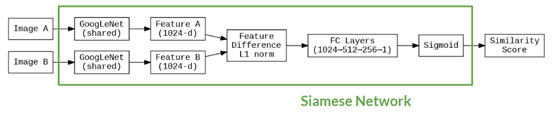
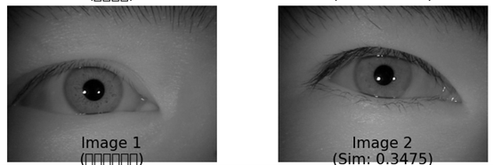
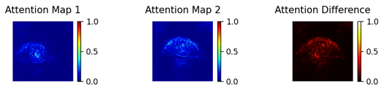

# Ganzin Iris Verification (Final Project)

This is the final project for NTU Computer Vision, focusing on iris verification using Siamese Networks and GoogLeNet as a shared backbone.

## 🔍 Project Overview

We implement an iris verification system trained on the CASIA-Iris-Lamp, CASIA-Iris-Thousand, and Ganzin-J7EF-Gaze datasets. The model uses a Siamese architecture with a shared GoogLeNet backbone, followed by distance computation and fully connected layers for similarity scoring.

## 🧠 Model Architecture

- **Backbone**: Pretrained GoogLeNet (shared weights)
- **Feature Extraction**: 1024-d feature vectors
- **Distance Metrics**: L1, Euclidean, or Cosine distance
- **Classifier**: Fully connected layers + Sigmoid
- **Output**: Similarity score (0~1)



## 📂 Folder Structure
```
b11901067/
├── model/ # Saved .pth model files
├── src/ # Training and evaluation scripts
├── bonus/ # Final bonus result files
└── test/ # Final test result files
```
## 🚀 How to Run

```bash
# Finetune the model
python src/tune_googlenet.py

# evaluate
# (remember to set checkpoint path in run.py and dataset path in result.py)
python src/result.py # this will run through run,py and eval.py
```

## 📊 Visualization
```bash
# Finetune the model
python src/plot.py
# this will run five method to visualize the decision made in the model
```


## 🧪 Datasets
CASIA-Iris-Lamp

CASIA-Iris-Thousand

Ganzin-J7EF-Gaze

## 📈 Performance
Best d' score on Lamp and Thousand dataset: 7.X; on gaze and gaze-bonus dataset: inf

ORB baseline matching also tested (not significantly helpful)

Preprocessing with cv2.HoughCircles tried but not adopted in final pipeline
